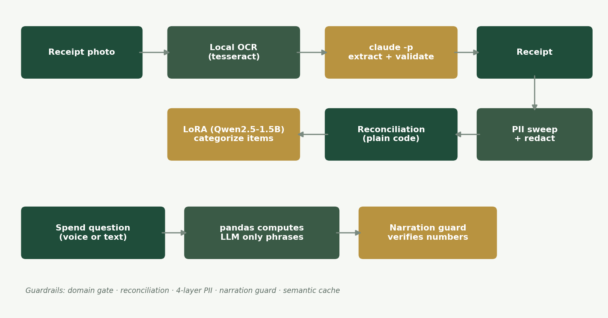

<p align="center">
  
</p>

# Receipt Auditor

Design and copy follow [these standards](https://github.com/lyhjeremy/lyhjeremy/blob/main/DESIGN_STANDARDS.md).

> **Product overview:** https://lyhjeremy.github.io/receipt-auditor/overview/

Photograph a stack of receipts: get reconciled, categorized spending data
and a voice-queryable dashboard, with **PII redaction, arithmetic
reconciliation, and a locally fine-tuned category classifier that beats
Claude's zero-shot guess on the exact task it was trained for.**

## Why

Handing a chatbot receipt photos and asking "how much did I spend on dining"
means trusting it to both read numbers correctly *and* not embellish the
answer. Receipt Auditor never lets the model do either: totals are
reconciled in plain code against the printed total, spending answers are
computed by pandas and only *phrased* by the model, with a guard that
rejects the phrasing if a number gets dropped or changed, and the receipt
schema itself has no fields capable of holding cardholder PII in the first
place.

## How it works

<p align="center">
  
</p>

- **Vision, entirely local.** No Gemini/OpenAI vision key required:
  `tesseract` OCRs each receipt photo, then `claude -p` (Claude Max
  subscription, no per-token cost) does the domain check and structured
  extraction from the OCR'd text in one call, refusing non-receipt photos
  and flagging low-confidence reads. Same local-OCR pattern used across this
  project family after the Gemini-quota pivot documented in the shared
  `AI_GAP_PROJECTS_ROADMAP.md`.
- **Reconciliation, in plain code.** `computed = Σ(line items) + tax`,
  compared to the printed total within a small tolerance. A mismatch is
  never silently "corrected". It renders flagged for a one-tap human
  review.
- **Categorization: a locally fine-tuned classifier.** Each line item is
  categorized by a **Qwen2.5-1.5B model, LoRA fine-tuned on this laptop**
  (`app.py`'s `categorize_item` calls the trained adapter directly via
  `mlx_lm.generate`, with a plain `"other"` fallback if the adapter isn't
  present: inspectable, not a black box).
- **PII, four layers deep.** (1) The `Receipt`/`LineItem` schemas simply have
  no fields for cardholder name, card number, address, or loyalty id. The
  vision model is never even asked for them. (2) Raw OCR text is discarded;
  only the validated `Receipt` object survives extraction. (3) A
  belt-and-braces regex sweep (`privacy.sweep_receipt`) redacts anything
  PII-shaped that slipped into a merchant/item string anyway, and reports how
  many redactions it made. (4) On a hosted Space, everything is session-only
  in memory. `Privacy.is_space_environment()` is the single source of truth
  both paths check before persisting anything.
- **The narration guard.** Spend-analysis answers are computed by pandas
  (`analysis.answer_query`); the LLM only phrases them into a sentence.
  `reconcile.assert_numbers_present` then asserts every number the model was
  given still appears in its phrasing, if not, the caller falls back to a
  template sentence. A hallucinated number is structurally impossible here,
  because the number never originated from the model.

## The fine-tune, honestly benchmarked

12-category spend classifier (groceries, dining, coffee_snacks, transport,
fuel, health, household, clothing, entertainment, subscriptions_utilities,
travel, other), trained on 4,799 synthetic line items across realistic POS
merchant styles ("SBUX #4821", "WM SUPERCENTER #2847", "TST* JOE'S PIZZA"),
split by merchant so no merchant straddles train/test.

| System | Top-1 acc | Macro-F1 | Latency | Cost/1k |
|---|---|---|---|---|
| Base Qwen2.5-1.5B (no fine-tune) | 27.7% | 0.333 | 5.0s | $0 |
| **+ LoRA (this project)** | **90.5%** | **0.893** | 4.5s | $0 |
| Claude (teacher, zero-shot) | 56.0% | 0.506 | 17.7s | Max subscription |

**The fine-tuned local model beats Claude's zero-shot accuracy by 34.5
points** (90.5% vs 56.0%). All three systems saw the identical blind prompt
(no category list given, matching the training format), so this is a fair
comparison of what each system brings on its own, not LoRA getting a hint
Claude didn't. Full numbers and methodology in [`eval/`](eval/) and
[`writeup.md`](writeup.md), generated by
[`training/bench_categorizer.py`](training/bench_categorizer.py).

**Known gap, reported not hidden:** there is currently **no real-receipt
held-out column**. The spec calls for 10–20 of Jeremy's real receipts,
photographed and hand-labeled, as the honest synthetic-vs-real tiebreaker.
These numbers are synthetic-only until that's supplied.

## Guardrails

- **Domain gate.** A non-receipt photo gets a friendly refusal, not a
  hallucinated card.
- **Reconciliation.** Arithmetic checked in code, never trusted from the
  model; mismatches flagged for human review, never auto-"fixed."
- **PII redaction.** Four layers (schema, discard-raw-OCR, regex sweep,
  session-only persistence), all described above with code pointers.
- **Narration guard.** Every spoken/written spend answer's numbers are
  verified present after phrasing, or replaced with a template sentence.
- **Semantic cache.** Repeat spending questions are an instant, free cache
  hit.

## Files

| File | Purpose |
|---|---|
| `app.py` | Gradio app (batch upload → reconciled grid → dashboard → voice query) |
| `scripts/gen_line_items.py` | Overnight synthetic corpus generator |
| `training/prep_categorizer.py` | Merchant-split, leakage-checked classifier dataset |
| `training/bench_categorizer.py` | 3-way honest benchmark (base/LoRA/Claude) |
| `src/reconcile.py` | Totals reconciliation + the narration guard |
| `src/privacy.py` | The four PII layers, wired together |
| `src/analysis.py` | Deterministic pandas spend queries |
| `src/` | Vendored toolkit (llm, vision, guardrails, context, cache) |
| `eval/` | Benchmark results, confusion matrix, loss curve, dataset card |

## Running it

```bash
pip install -r requirements.txt
./setup_ocr.sh                          # tesseract + language packs (one-time)
python scripts/gen_line_items.py        # synthetic corpus (overnight, resumable)
python training/prep_categorizer.py     # merchant-split train/valid/test
bash training/lora_harness/train.sh mlx-community/Qwen2.5-1.5B-Instruct-4bit \
    data/lora training/adapters 4 12 800 1.5e-4 768
python app.py
```

No API key required, everything runs locally except a `claude -p` call for
extraction (uses your Claude subscription, not a metered API).

## License

MIT, see [`LICENSE`](LICENSE).
