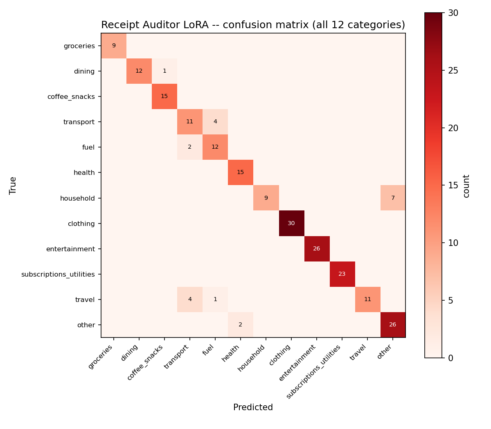

  

# Receipt Auditor: a finance app where the model is never allowed to do arithmetic

*Photograph a stack of receipts, get reconciled spending data, and a
locally fine-tuned classifier that categorizes each line item better than
Claude does cold.*

## The idea

Ask a chatbot "how much did I spend on dining last month" from a pile of
receipt photos, and you're trusting it to read every number correctly *and*
report the sum honestly, two separate ways for it to be confidently wrong.
Receipt Auditor is built around a different rule: **the model narrates, the
code computes.** Totals are reconciled against the printed total in plain
Python. Spend queries are answered by pandas. The model only ever phrases a
number it was handed, and a guard checks that the number survived phrasing
unchanged.

It's also a testbed for five specific engineering skills, same as the rest
of this project family: fine-tuning, guardrails, multimodal input, context
engineering, and token optimization. Each with a real number attached, not
a bullet point.

## No Gemini key, no problem

Like its sibling projects, this one was originally spec'd around Gemini's
vision API for receipt extraction. Two API keys tested in Session 1 both
authenticated but had zero free-tier quota provisioned. A
project-configuration issue on Google's side, not a rate limit that clears.
Rather than block on a third key, extraction was rebuilt to be **fully
local**: `tesseract` OCRs the receipt photo, then `claude -p` (my Claude
subscription, no per-token API cost) does the domain check and structured
field extraction from the OCR'd text in one call, refusing non-receipt
photos, flagging low-confidence reads. Zero external dependency, same
guarantees.

## Reconciliation and the narration guard: arithmetic the model never touches

Every receipt's computed total (`Σ line items + tax`) is checked against the
printed total in plain code, with a small tolerance for rounding noise. A
mismatch renders flagged for a one-tap human correction. The model never
gets to quietly "fix" a total that doesn't add up.

The same discipline extends to spend analysis. When you ask "how much did I
spend on dining," pandas computes the real number from the parsed receipts;
the LLM's only job is to phrase it as a sentence. After phrasing,
`assert_numbers_present` checks that every number the model was given still
appears in its output. Verbatim, allowing only reasonable rounding (`$42`
vs `$42.00`, not a changed value). If a number gets dropped or altered in
phrasing, the caller falls back to a plain template sentence instead of
shipping the LLM's version. A hallucinated spend total is structurally
impossible here, because the number the model speaks was never the model's
to invent.

## Privacy: four layers, not a policy statement

1. **Schema-as-guardrail.** `Receipt` and `LineItem` simply have no fields
   for cardholder name, card number, address, or loyalty id. The vision
   model is never even asked to extract them. The cheapest PII control is a
   schema that can't hold PII.
2. **Raw OCR text is discarded.** Only the validated, schema-checked
   `Receipt` object survives extraction; the OCR'd text itself is never
   cached, logged, or persisted anywhere.
3. **Belt-and-braces sweep.** `privacy.sweep_receipt` runs a regex redaction
   pass over every merchant/item string before it touches cache or
   persistence. Long digit runs (card fragments) get last-4-masked, emails
   and phone numbers get replaced with `[redacted]`. The redaction count is
   surfaced, not hidden.
4. **Persistence policy.** `privacy.is_space_environment()` is the single
   source of truth both the local and hosted paths check: on a Space,
   receipts live in memory for the session and nothing touches disk; locally
   a git-ignored ledger opt-in is allowed.

## The fine-tune: a classifier that beat the teacher by 34 points

The task: given a merchant string and a line-item description, predict the
spend category: 12 classes, from `groceries` to `subscriptions_utilities`.
**4,799 synthetic line items** generated via `claude -p` across deliberately
varied POS abbreviation styles real receipts actually use ("SBUX #4821", "WM
SUPERCENTER #2847", "TST* JOE'S PIZZA", full readable names, generic local
merchants), split **by merchant** (not by row) so no merchant's items
straddle train and test: 2,537 distinct merchants in train, 158 in test,
zero overlap.

A Qwen2.5-1.5B model was LoRA fine-tuned locally (MLX, Apple Silicon, same
hyperparameters as this project family's other classifiers: batch 4, 12
layers, 800 iterations, lr 1.5e-4), training loss fell from an initial
val loss of 5.085 to 0.419 over 800 iterations
(`eval/loss_curve.png`). Benchmarked three ways on a held-out 220-row test
set, **all three systems given the identical blind prompt** (merchant +
item, no category list in-context, matching what the LoRA model actually
trained on, the same methodology this project family used for Cellar
Scanner's variety classifier):

| System | N | Top-1 acc | Macro-F1 | Latency | Cost/1k calls |
|---|---|---|---|---|---|
| Base Qwen2.5-1.5B | 220 | 27.7% | 0.333 | 5.0s | $0 |
| **+ LoRA (this project)** | 220 | **90.5%** | **0.893** | 4.5s | $0 |
| Claude (teacher, zero-shot) | 150 | 56.0% | 0.506 | 17.7s | Max subscription |

The headline: **the fine-tuned local model's Top-1 accuracy (90.5%) beats
Claude's zero-shot Top-1 (56.0%) by 34.5 points**, and both numbers come
from the exact same blind prompt, so this isn't LoRA getting a vocabulary
hint Claude didn't see. Fine-tuning bought a **3.3x lift** over the
untrained base model. This is a narrower, more memorizable task than Cellar
Scanner's 40-variety wine guess (12 classes on a synthetic corpus with
consistent internal structure), which is exactly why the gap over a
zero-shot frontier model is so much larger here. Claude has to guess a
category *name* cold with no enumerated options, while the LoRA model
learned the label space directly from its training signal.

The confusion matrix (`eval/confusion_matrix.png`) shows where the LoRA
model still slips: `household` items called `other` (7 of its confusions:
genuinely ambiguous items like generic home-goods purchases), `travel`
confused with `transport` and `fuel` (a car-adjacent, geographically
overlapping trio even for a human categorizing a credit card statement), and
a few `transport`/`fuel` mix-ups in both directions.

  

**One gap reported, not hidden:** there is **no real-receipt held-out
column**. The spec (`RECEIPT_AUDITOR_SPEC.md` §5) calls for 10–20 of
Jeremy's actual receipts, vision-extracted and hand-labeled, as the honest
synthetic-vs-real tiebreaker, precisely because Claude both labeled the
synthetic training data *and* is the zero-shot reference column, so a
same-distribution benchmark alone can't fully rule out the synthetic corpus
being easier than real-world receipts. That set hasn't been supplied yet;
the 90.5%/56.0%/27.7% numbers above are synthetic-only, and the writeup says
so rather than presenting them as the final word.

## Context engineering and token optimization, measured not claimed

Voice and text spending questions are parsed into a structured `Query`
(metric, category, merchant, date range) via the same
`generate_validated` retry loop every project in this family shares, then
answered entirely by pandas. The LLM sees the question and the final
number, never the underlying dataframe. Repeat questions ("how much did I
spend on dining this month," asked twice) hit a semantic cache keyed on
question similarity, avoiding a repeat parse-and-phrase round trip.

## What building this taught me

- **Two real bugs, caught immediately by the test suite, not in
  production.** The `Receipt` schema originally risked a `date` field
  shadowing Python's `datetime.date` type. A classic naming collision that
  breaks Pydantic model construction outright the moment both the field name
  and the type import collide in the same scope. And the narration guard's
  original number-extraction regex could match a bare trailing comma left
  over from a comma-separated sentence (`"...$120.00, up from..."`) and crash
  on `float("")` when trying to parse it as a number. Both were caught by
  writing realistic test cases *before* trusting the code. A sentence with
  multiple comma-separated numbers for the second one, and both are fixed;
  19 tests pass across reconciliation, privacy, and analysis.
- **A benchmark timeout that turned out to be someone else's CPU load, not
  a bug in this project.** The first live benchmark run hit repeated
  90-second timeouts on `mlx_lm.generate` calls that normally take a few
  seconds. Instead of assuming the model or the harness was broken, checking
  system load first (`uptime`, `ps aux` sorted by CPU) showed two unrelated
  VS Code helper processes consuming 97% and 65% CPU on this 10-core
  machine, nothing to do with this benchmark. Raising the subprocess
  timeout to 240 seconds (rather than "fixing" code that wasn't broken) let
  the run complete cleanly.
- **A logging path that silently wrote nothing, caught before it mattered.**
  `train.sh`'s `tee` command was supposed to write the full training log to
  `training/adapters/train.log` for the loss-curve script to parse, but the
  file came out at 0 bytes even though training itself completed
  successfully, likely a quirk of piping through a Google-Drive-synced
  directory. The same content had already landed in the outer run log from
  a different redirect, so the loss curve was reconstructed from that
  instead of being silently lost.

None of these would have surfaced from reading the code alone. Every one
came from actually running the pipeline and treating an unexpected number,
timeout, or empty file as a bug report worth investigating, not noise to
retry past.

---

*Built by [Jeremy Lee](https://github.com/lyhjeremy). Code, benchmark, and
dataset card: [github.com/lyhjeremy/receipt-auditor](https://github.com/lyhjeremy/receipt-auditor).*
